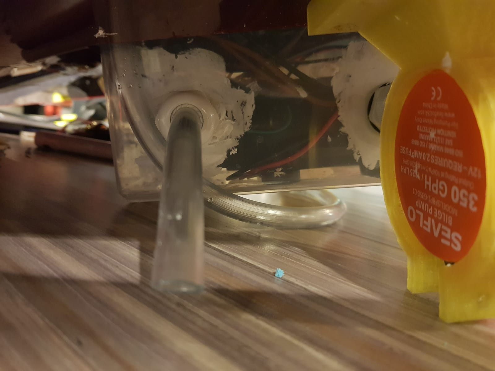

# Boat Final Report
## Initial thinking process

When we first came up with the idea of the party boat we had to list out our contraints and functional requirements of our boat. This was done not only to ensure everyone on the team had a common goal but also know about every specificationn of the ship.


### Shape:
We started with a rectangular shape at first as we felt it allowed the most efficient use of space. On top of that, it  was the most common type of shape that blue foam was sold at.
However, we soon learn we had to factor in drag as well.
Thus we had decide to round the front of the boat to a bullet shape, reducing overall drag.
Cuboid drag coefficient: 0.82(roughly)
Bullet drag coefficent: 0.295 (roughly)
Hence by choosing this shape, we have factored in both the ease of fabrication as well as the most efficient use of the area of the boat.
Material:
Regarding the project, we had to choose a material that would act as our buoyancy force to counter act the weight that was going to be added onto the boat.
We had a few options:
#### 1.	Pvc pipes
Would’ve sealed the tube, trapping the air, using the trapped air as buoyancy
-	Pros:
-	Have very high buoyancy
-	Cheap and easy to source
-	Cons:
-	Hard to fabricate into the shape we want
-	Since we are going for a party boat, the aesthetics we had to have a nice look and pvc was not cut out for it 

#### 2.	Blue foam
##### Pros:
-high buoyancy
-easy to shape
-easy to source
##### Cons:
-malleable and soft, hard to secure
-considerably expensive
-harmful to health
#### 3.	Wood
##### Pros:
-cheap 
- hard,easy to secure
-easy to source

##### Cons:
-	Not as buoyancy
#### 4.	Metal
##### Pros:
-hard, easy to secure
-high  strength
##### Cons:
-	Hard to fabricate
-	Hard to source
-	Expensive
-	Prone to water corrosion
As such we have decide to use to blue foam as our choice of material as we decided that its pros far out weigh its cons as well as it fits into our aim of a party boat, allow buoyancy without any weird n awkward shapes like pvcs.

### Structure:
So for this boat, I have categorise the structures into 5 main parts,
This is there’s a distribution of workload of the items itself and to ensure that if one component fails, the other wouldn’t
#### 1.	The buoyant force giver
This would be the blue foam itself, however, since blue foam is soft , no structural stresses should be loaded onto it other than weight
#### 2.	The skeleton
The main component to have stress loaded onto it. We have decided to use aluminium extrusions. Though they maybe heavy, as we have calculated, the buoyant force generated by the blue foam would be more than enough to carry the extra weight.
#### 3.	The pressure distributor
We have decided to use acrylic to spread the pressure of the parts across the whole boat, as blue foam is soft, it would prevent nicks and indentation across the blue foam it self. We have decided to use PL 114, a red clear acrylic sheet as we have thought that the contrast would look nice with the boat.
#### 4.	Mounting mounts
These are the components that secure the other tertiary structure to the aluminium skeleton. These includes l brackets, the bilge pump holder and may more!
#### 5.	Main features, these would include stuff like the cannons, main ship structures.


### Items:
In this project, there were many electrical parts as well as many functionality parts to be assembled so for this part, there were many planning and designing to do to make sure that the boat structure could fit everything.
#### Blige pump 
The function of the bilge pump in this case is to propel; the boat
Because the pump is already waterproofed, we decided to choose the bilge pump to cut down on time as well as the thrust it provides.
 
 
The pump is cutted down, turning it into a motor essentially.
The impeller is then swapped with that of a propeller to provide thrust to the boat.
Due to the thrust provided by the pump, it is necessary to firmly secure the pump onto the boat . and to do that, theres a need to design a holder.
   
   
   
The design for the bilge pump relies heavily on tension to keep the pump in place. As such, the threshold for tightening in this design is low. The diameter is just an mm off to account for shrinkage factor of the 3d printer.
To tighten, bolt the bolt through the top 2 holes .
To mount there are 4 holes at its base to mount the holder to the skeleton.
-to be mounted on the onderside of the boat
#### Cannon 
The cannon’s function is to swivel and shoot people with high pressure water.
In order to achieve this, 2 main electric components are used, the diaphragm pump, and the SR310 13kg precision servo.
However, these 2 components aren’t waterproof thus we need to design and build a structure that does exactly that as well as it functions.
The 3 main parts for the cannon function:
1.	servo
2.	diaphragm pump

##### 1.	servo

 
The servo is fitted into a water tight container, leaving the designed components out of the box that transfers the action of the servo to that of the cannon.

 
This design incorporated the given servo horn of the servo.
This way it can be assured that the connecting rod(which turns and secure the cannon)
that’s mounted onto the servo is mounted securely with no chance of slip. There’s also an O ring in between the canon mount and the plastic cover to prevent water from enter and damaging the servo.
there’s a reducer attached to increase the pressure on the water being shot put, accommodating to the main aim of the party boat to shoot water at people.


Now that the main structure of the cannon is explained, next would be the tube that’s connecting to it.
There’s a slot in the pirate acrylic piece to accommodate for the swivel of the tubing that carries the water from the diaphragm pump to cannon. 
##### 2.	Diaphragm pump

 
The diaphragm pump is also waterproofed by putting it inside the main electronics box. The tubing is then fitted through the cable gland and out, intaking water from one side and the other to the cannon.
The cable gland is sealed and waterproofed by using a sealant(will be discussed later during the waterproofing part)


#### Pirate boat structure.
Because the function of the boat is a party boat, there is a need to make the boat aseptically pleasing. As such, there is a need to design a structure to hide the not so pleasing parts( the main electronics box)

Since the structure carrying hiding the electronics box would be big, the structure would also need to be able to carry the speakers as well as holes for the wires to branch out, ease of access to the water proof container and look aesthetically pleasing.
 

##### 1.	Ease of access.

   
Though the structure is to hide the waterproof box, there is still a need to make the structure able to access the water container easily to tweak any electrical component when necessary.


##### 2.	mounting of speakers
 
 There are to holes to mount the speaker at the very top. 
As the music is supposed to be for all to hear, there is a need to mount the speakers at the top to allow the music to reach as many ears as the speaker allows.

##### 3.	Aesthetically pleasing
 
There the inclusions of stairs to try to make it more pleasing


## Fabrication Process
### Fabrication of the aluminium frame
We salvaged profiles from the previous project and used the hacksaw to get aluminium profiles with length of 350mm and 230mm. We used 2 of 400mm, 2 of 250mm and 2 of 230mm aluminium profiles. We used mushroom head screws to secure the profiles in place by positioning it with holes drilled along the profile.


### Fabrication of the blue foam

#### Slots fabrication
Initially, we used the hot wire foam cutter to try to cut slots. However, it failed due to inability to control the string’s tension even though the foam was cut into 4 pieces to make it easier to cut. However due to the height of the foam that was going through the string caused it to swing (as seen in figure 1), causing it to cut more. We wanted to try another method which was milling. We used the damaged piece to try testing milling with different speeds (Figure 2)

Figure 1 

Figure 2 

We used a 20 mm drill bit as it was the size of the profile which also meant that there is not much allowance for any errors. After experimenting, we deduced to use 1100 rpm to cut the blue foam. We used 4 of 25mm thick blue foam to mill. We made two pieces each of the design shown in figure 3 and 4. One piece with dimensions from figure 3 and 4 will be placed together with the slots facing each other to form half of the buoyancy device.

Figure 3 

Figure 4 

Cutting the actual bluefoam


#### Holes fabrication
We used a 4 mm drill bit with the same rpm but the rate of decent was slow so as to prevent any damage to the surrounding and to prevent the hole from expanding. To be more precise so as to fit the acrylic perfectly, we continued with the milling machine instead of using the hand drill with manually marking it out with a ruler and tri-square. The dimensions are below.

Top piece 


Bottom piece


#### Container holes fabrication
We decided that using the wire cutter will be faster than milling the holes in figure 5 as it was already in 2. As we wanted to create more tension to hold the containers in place, we created a tightening strip as shown in figure 6. This shape was used to allow more compressive forces produced by the container.

Figure 5 


Figure 6 


#### Curves fabrication
We used the wire cutter to cut a rough estimate along the curve offsetting 3-5 mm from the actual curve so as to ensure that the wire’s variable tension throughout the process does not affect the cut. Then we used the orbital sander to sand it down as it will be smoother, and we can use it along the acrylic piece as a guide. This process was done after the acrylic piece was laser cut. 


#### Fabrication of the acrylic piece
We used the laser cutter to fabricate the following holes and shape which aided in cutting the shape we wanted for the blue foam.


### Fabrication of components

We have 3D printed these components

- brackets
- SPeaker holder
- main cannon and holder
- Pirate with the wheel
- Crew with treasure chest
- staircase with wooden crates
- cannons on the outer
- Bilge pump holder


We printed and painted all of these characters with a pirate theme in mind. The paint used is insoluble in water. One of the core components is the Main canon and the holder which is connected to the servo. The Bilge pump holder is also another core part in delivering the proper thrust needed.


# Power Consumption

## Initial power consumption

Initially, we followed the specifications of the pumps online to do a brief calculations. The values did not make much sense but here it is:
- ```mp3 module``` : 0.6 A @ 5 V
- ```High pressure caravan pump``` : 6.0 A @ 12 V
- ```LED strips``` : 1.96W/meter (3 meters)
- ``Bilge pump``` : 3.0 A @ 12 V
- ```High torque servo''' : 3.3kg @ 6 V

However, upon being advised to characterize the pumps and electronics by Mr. Rodney on 10th January 2018, below are our findings

- ```mp3 moduel``` : 0.3 A @ 6 V
- ```High pressure caravan pump``` : 0.6A @ 12 V
- ```LED strips``` : 1.15A @ 12V
- ```Bilge pump``` : 0.4 - 1.5 A @ 12 V
- ```High torque servo``` : 0.6 - 1.0 A @ 6V
- ```System Idle``` : 0.16A @ 12V

Since

``` total power dissipation = sum of individual power dissipation/consumption ``` 

and 

``` P = I * V ```

Hence, the "theoretical practical power dissipation" is:

``` Total Power = 0.3 * 6 + 0.6 * 12 + 1.15 * 12 + 1.5 * 12 + 1 * 6 + 0.16 * 12```
``` Total Power = 36 W```

If everything runs at full power for the whole duration @ 12 V, assume chips can operate for the full duration, the ship will be able to run for around 20 mins.

However, our final iteration uses the L298N and 3 voltage regulators. Hence with the power dissipation increasing and converting as heat, it will reach a dangerous temperature. We have only tested moderate using (medium powered lights with occasional movements and shoots around 5 times per minute), the boat is able to stay in the water for at least 3-5 minutes.

The program logic is as follows:

