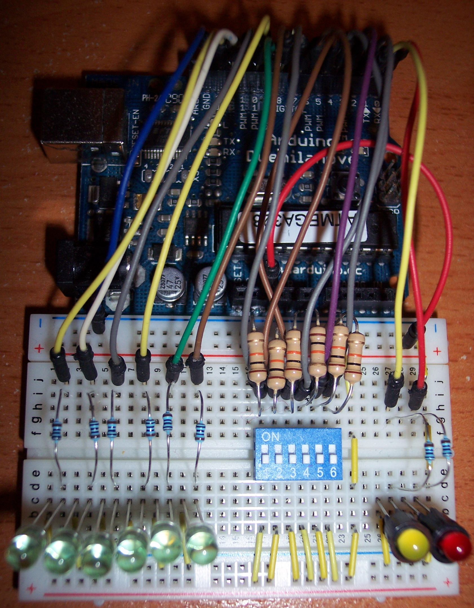

# Interfacing UNO with computer

First, download the Arduino ide from this website: [Arduino.cc](https://www.arduino.cc/en/Main/Software)

Next, upload the example Blink code as a start following this circuit:


```/*
  Blink

  Turns an LED on for one second, then off for one second, repeatedly.

  Most Arduinos have an on-board LED you can control. On the UNO, MEGA and ZERO
  it is attached to digital pin 13, on MKR1000 on pin 6. LED_BUILTIN is set to
  the correct LED pin independent of which board is used.
  If you want to know what pin the on-board LED is connected to on your Arduino
  model, check the Technical Specs of your board at:
  https://www.arduino.cc/en/Main/Products

  modified 8 May 2014
  by Scott Fitzgerald
  modified 2 Sep 2016
  by Arturo Guadalupi
  modified 8 Sep 2016
  by Colby Newman

  This example code is in the public domain.

  http://www.arduino.cc/en/Tutorial/Blink
*/

// the setup function runs once when you press reset or power the board
void setup() {
  // initialize digital pin LED_BUILTIN as an output.
  pinMode(LED_BUILTIN, OUTPUT);
}

// the loop function runs over and over again forever
void loop() {
  digitalWrite(LED_BUILTIN, HIGH);   // turn the LED on (HIGH is the voltage level)
  delay(1000);                       // wait for a second
  digitalWrite(LED_BUILTIN, LOW);    // turn the LED off by making the voltage LOW
  delay(1000);                       // wait for a second
}
```
# Performing digital reading from DIP switches

This step requires a dip switch, a few wires and a few LEDs. We followed a [simple tutorial](https://www.tinkerhobby.com/arduino-led-control-using-dip-switch/) found in the public domain.



```
// www.TinkerHobby.com
// Natalia Fargasch Norman
// LED control via DIP switches

// Arduino pins used for the LEDs
#define LED1 13
#define LED2 12
#define LED3 11
#define LED4 10
#define LED5 9
#define LED6 8

// Arduino pins used for the switches
#define S1 7
#define S2 6
#define S3 5
#define S4 4
#define S5 3
#define S6 2

// State of each switch (0 or 1)
int s1state;
int s2state;
int s3state;
int s4state;
int s5state;
int s6state;

void setup() {
  // pins for LEDs are outputs
  pinMode(LED1, OUTPUT);
  pinMode(LED2, OUTPUT);
  pinMode(LED3, OUTPUT);
  pinMode(LED4, OUTPUT);
  pinMode(LED5, OUTPUT);
  pinMode(LED6, OUTPUT);
  // pins for switches are inputs
  pinMode(S1, INPUT);
  pinMode(S2, INPUT);
  pinMode(S3, INPUT);
  pinMode(S4, INPUT);
  pinMode(S5, INPUT);
  pinMode(S6, INPUT);
  // setup serial port
  Serial.begin(9600);
  Serial.println("Serial port open");
}

void loop() {
  s1state = digitalRead(S1);
  digitalWrite(LED1, s1state);
  s2state = digitalRead(S2);
  digitalWrite(LED2, s2state);
  s3state = digitalRead(S3);
  digitalWrite(LED3, s3state);
  s4state = digitalRead(S4);
  digitalWrite(LED4, s4state);
  s5state = digitalRead(S5);
  digitalWrite(LED5, s5state);
  s6state = digitalRead(S6);
  digitalWrite(LED6, s6state);
  Serial.print(s1state);
  Serial.print(s2state);
  Serial.print(s3state);
  Serial.print(s4state);
  Serial.print(s5state);
  Serial.print(s6state);
  Serial.println();
}
```

Our results are similar as the tutorial's.

# Reading Voltage with ADC and a voltage divider circuit.

We have briefly discussed the possibility of using this to create a battery indicator. However, with further thoughts we have placed it as a backup plan as it consumes uneccessary power. It would be better to use a voltage sensor and a current sensor to detect the power output of a motor.

[Here](https://www.instructables.com/id/Arduino-AnalogRead-Serial-With-Potentiometer/) is the link we followed. 

Note: we were aware of the similarity of a potentiometer and a voltage divider. At that time, a potentiometer made an easier and cleaner circuit for demonstration purposes.


```// This example code is in the public domain

void setup() {

Serial.begin(9600);

}

void loop() {

int sensorValue = analogRead(A0);

Serial.println(sensorValue);

delay(1);

}
```

# Deciding on what sensors we require
Below are the sensors we think we will need (idea of boat is in ideation progress)
- voltage sensor
- current sensor
- ultrasonic sensor
- infra-red sensor

We are unable to come out with any specifications at this stage as our project ideas are not yet finalized.
